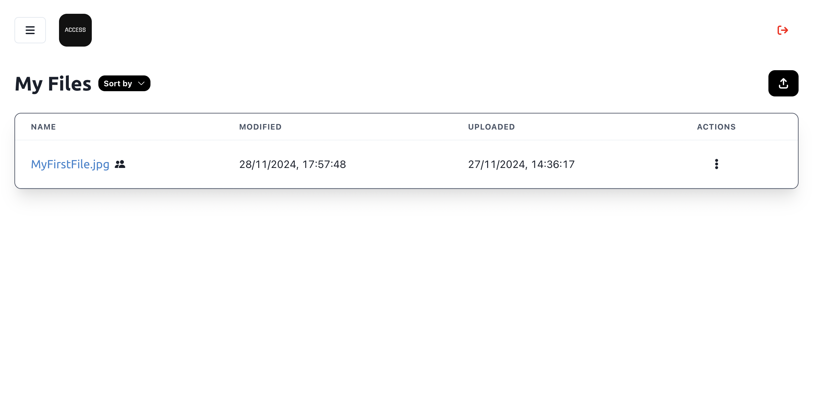

# Access

**Access is a simple, easy-to-use cloud file storage system with neat features like file sharing and sorting. 🙌🤩** It is the perfect tool for quick, efficient and hassle free online file storage. ✨

Access is a Python Flask web server that renders a Vite-built React frontend designed with Chakra UI. The system can also use Firebase Realtime Database to act as a robust cloud database system. Incorporating a variety of complex logic, services and integrations, Access delivers a clean and smooth user experience for users. 🚀🤯

Hopefully, the system is live at: https://access.prakhar.app! 🎉

## Show Don't Tell

## Background

## Access 2.0