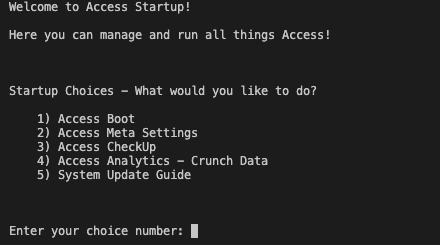

# Access

## Q. What is Access?

**Access is a wholly hand-written web application that allows users to create their own Access Identities and store personal files in the application. Inspired by Google Drive and other cloud storage services such as OneDrive, Access is a flask-based application that allows users to securely login and download secure files from the site.**

---

# Table Of Contents

- [The Origins](#the-origins)
- [About The System](#about-the-system)
- [What the project means to me](#what-this-means-to-me)
- [Project Roadmap](#what-comes-next)

For people who want their own copy of the system:
- [Setting up The System](#setting-up-the-system)
    - [Activator](#activator)
    - [Access Startup](#access-startup)
        - [Boot Authorisation Code](#boot-authorisation-code)
    - [Steps for the Admin](#steps-for-the-administrator)
- [Updating the System](#updating-the-system)

# The Origins

One day, I was going through the files I have stored on my OneDrive account and I realized that this simple cloud storage service is actually quite a marvelous feat. I wanted to make a mock-up cloud storage application of my own and hence I decided to make Access. I am a self-taught programmer and I have been learning Python and have built [Flask](https://flask.palletsprojects.com/en/2.1.x/) applications for the past few months.

# About The System

An Access Identity is known as the account that a user can create to navigate and access the various services Access has to offer. An Access Identity can be logged into with an email and a password.

I put security at the forefront of my design for the application. Around 1200 lines of code have been dedicated to ensure that every transaction on the site is secure and is authorised. Custom designed certificate generation, authentication token and API authorisation algorithms have been implemented in this web application to ensure the most secure experience.

> ABOVE: A screenshot of the login page of the system

Access is easily the biggest web server I have ever built; with Python as its backbone for the code, this web server has over 40 code files and nearly 4000 lines of code. The system in itself has 7+ sub-systems and services that aid the system administrator to fix any issues that arise in the system. The Access CheckUp Service, Access Analytics Recovery Mode and error-prevention measures worth more than 800 lines of code are just a few of them to name. 

The Access Analytics service also crunches data about the system's usage and generates savable usage reports for the administrator.

The entire system unanimously acts as a complete backend and frontend system. On the website itself, when the user logs in, the user is able to manage their account, upload/download/delete files from their Access Folder and more. The UI was designed with the help of [Bootstrap](https://getbootstrap.com). Login alerts, folder registration and identity creation emails are also sent to the user. By default, file uploads are limited to 3. You can change this by setting `FileUploadLimit` to whatever number you want in the `.env` file.

> ABOVE: A screenshot of the home page of the Access Portal

# What This Means to Me

Access is a project that I spent hours on because I really liked developing web servers. After my [AWS Combustifier Project](https://prakhar896.github.io/Access), I wanted to continue to use the Python and Flask skills I learnt to make soemthing bigger and better.

Every year I always challenge myself to make something bigger than before and this year Access broke my record number of code files. This project indeed means a lot to me as it actually has really useful real-world applications.

Once again, if you wanna try out Access for yourself, simply create your own identity at the [demo portal here.](https://access-1.drakonzai.repl.co)

# What comes next

Though large, this project still has a lot of work to do. Here is my project roadmap:

UPCOMING FEATURES:

- New Access Admin portal, where admin signs-in and can view/manage/edit all identities in the system
- Completion of all the settings that are found in a user's Access Portal (DONE in `v1.0.2`)
- Miscellaneous endpoints such as `/version` to view more information about the system (DONE in `v1.0.2`)
- Back-tracking links on relevant error pages (DONE in `v1.0.2`)
- Certificate Renewal Code Retreival process (DONE in `v1.0.2`)
- Improvement of create identity process with more secure password checks (DONE in `v1.0.2`)

and much more!

And that's Access, the cloud storage service built for convenience and ultimate security.

---

For people who want their own copy of the system:

# Setting up the System

I have made this project as clone-friendly as possible. Setting up and running this system for yourself is extremely easy.

## Activator

[Activator](https://github.com/Prakhar896/ActivatorDocs) is a product activation service that activates copies. It also provides users a unified dashboard to manage all of your activated copies across several products that conform to Activator's DRM (Digital Rights Management) process. Access is one of these products.

### How It Works

Any copy of Access will first need to be activated with Activator. You do not have to do anything on your part; upon boot, if not activated, Access will locate the latest Activator server and will activate itself. A `licensekey.txt` file will be downloaded that will contain the license key for the copy. This file will be used to verify the copy's authenticity.

**DO NOT** delete the `licensekey.txt` file. If you do, the copy will be deactivated and will need to be activated again.

Every 14 days, the copy will automatically trigger a license key verification request (KVR) to ensure that the copy is still activated. If the copy is not activated, it will be deactivated and will need to be activated again. (Run the copy code again.)

### What I Can Do With Activator

During copy activation, the activation script generates unique identifiers for the computer it is being run on (and is named Hardware Serial Number (HSN)) and for the copy itself (which is called Copy Serial Number(CSN)).

These identifiers are submitted to Activator servers. (NOTE: None of your private computer information is divulged in the activation process.) If an account with the same HSN is found, the CSN is added to the account. If no account is found, a new account is created with the HSN and CSN.

Then, you can log in to Activator using the link provided in the `licensekey.txt` file. You will be able to see all of your activated copies and their CSNs. You can also manage your account, link other HSN accounts as aliases and much more.

> For more information about Activator, see its [documentation](https://github.com/Prakhar896/ActivatorDocs)

## Access Startup

At the top of the system, the Access Startup service (whose code is in [`accessStartup.py`](accessStartup.py)) controls and allows the administrator to start/activate any service/sub-system. With the help of Startup, you can do any of the following:

1) Boot Up Access - This option will actually run [`main.py`](main.py) and boot up the Flask web application. After activating and doing some processing, the system will serve HTTP content on the `RuntimePort` that was set in the `.env` file.
2) Access Meta Settings - This option allows an admin to change some system configurations. Collected Analytics data can be cleared, Analytics Recovery Mode can be activated, all data files that store system and user information can be deleted and the [Boot Authorisation Code](#boot-authorisation-code) can be configured.
3) Access CheckUp Service - This option will run the [`accessCheckUp.py`](accessCheckUp.py) service that will scan the entire system to make sure that everything is okay and that the system is safe to run. It will produce a set of critical issues (indicating that the system cannot be run) and/or warnings (the system can be run) that are detected.
4) Crunching Analytics Data - This option allows the admin to run the data crunching function which will analyse all the usage data collected by the system and will generate a report. This can only occur if `AccessAnalyticsEnabled` was set to `True` in the `.env` file.
5) System Update Guide - This option will output a chunk of text that will guide the admin with the steps to update the system to a newer version.

> ABOVE: A screenshot of the main menu of the Access Startup service

---
#### Boot Authorisation Code

The Boot Authorisation code is a security measure that is in place to prevent the system from booting up if the code is not correct. This is to prevent the system from being booted up accidentally/by a person who is not the admin.

If set, whenever Access is booted up, the system will ask for the code before beginning its boot pre-processing and system initialization processes. If incorrect, the boot will be aborted.

This code can be set/deleted/updated via the Access Meta Settings option in the [Access Startup menu](#access-startup).

By default, no boot authorisation code is set.

> ABOVE: A screenshot of the boot authorisation code prompt

---

## Steps for the Administrator

First things first, run `accessStartup.py` in your native command line using [Python 3](https://python.org) or above. You should see that Startup installs all the required system dependencies from the `requirements.txt` file as it detects that they are not installed. Do not choose any option and quit the menu by using the keyboard shortcut `Control Key + C`.

Before booting Access, some environment variables will need to be set in a `.env` file. Don't know what a `.env` file is? Click [here](https://malware.expert/general/what-is-env-files/#:~:text=env%20file%20or%20dotenv%20file,your%20Application%20will%20not%20change.)

First, create your `.env` file.

Then, The following variables are required to be set:

- `AccessAPIKey`: This is the API key that will be used to check all incoming POST requests are authorised. This must be set to `access@PRAKH0706!API.key#$69`
- `AssignedSystemEmail`: This field should have the email address that you intend for the system to use to send emails to users. Ensure that `Less Secure Apps` is set to `On` in the [Google Account Settings](https://myaccount.google.com). Note that the email has to be a Google Email.
- `AccessEmailPassword`: This field should be the password to the email account that you set in the `AssignedSystemEmail` field.
- `APP_SECRET_KEY`: This can be set to anything you like.
- (OPTIONAL) `GitpodEnvironment`: This field can only be set either `True` or `False`. If you are in a [Gitpod](https://gitpod.io) Environment, setting this field to `True` will disable all emailing services of the system and will prevent emails from being sent. This allows the system to not crash in an attempt to send an email as emails cannot be sent in a [Gitpod](https://gitpod.io) Workspace.
- `AccessAnalyticsEnabled` - This field can only be set either `True` or `False`. If set to `True`, you hereby grant the Access Analytics service permission to collect and store system usage data in a text file in the system folder. This data can be used by the admin to crunch and get reports on the system's usage.
- `RuntimePort` - This field can be set to any integer, typically over 8000. This is the port that the system's Flask web application will run and server HTTP content on.
- `ReplitEnvironment` (OPTIONAL) - If set to `True`, Access will re-install all dependencies. Will be required if run in a replit.com environment.

--- 
**After setting the environment variables, it is recommended that you run Access CheckUp via the [Access Startup menu](#access-startup). There should be some warnings popping up when Access CheckUp is finished (these are about the missing database files in the system that are yet to be automatically generated by the system because it isn't booted yet) but no critical issues should be detected. If any are, you should fix them immediately.**

> ABOVE: A screenshot of the ideal output when Access CheckUp is run after setting environment variables and before Access is booted for the first time

---

After doing this, you are ready to boot up Access. In the [Access Startup menu](#access-startup), select the `Access Boot` option. You should see that the system does some boot pre-processing and finally starts up the Flask application on the runtime port. You can now access the Access Portal via the following URL: `http://localhost:<RuntimePort>`.

# Updating the System

Run Access CheckUp to see if the system is on the latest version. If not, a critical issue should be outputted in the end. In the event this happens, you can update the system using the Access Updater Service (aka the `updater.py` file), which makes it ridiculously easy to update. The System Update Guide in the [Access Startup menu](#access-startup) contains a brief
description on how to use it.

> ABOVE: Sample update guide that would be outputted.

NOTE: If you are updating from `v1.0.1` to a newer version, you will have to manually update the Updater service itself by running the `git checkout updater.py` command in your native command line. This will bring the Updater service forward to the version you are updating to.

© 2022 Prakhar Trivedi