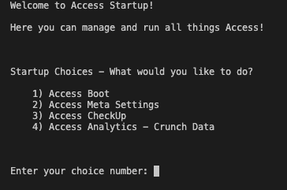

# Access

## Q. What is Access?

**Access is a wholly hand-written web application that allows users to create their own Access Identities and store personal files in the application. Inspired by Google Drive and other cloud storage services such as OneDrive, Access is a flask-based application that allows users to securely login and download secure files from the site.**

---

# Table Of Contents

- [The Origins](#the-origins)
- [About The System](#about-the-system)

# The Origins

One day, I was going through the files I have stored on my OneDrive account and I realized that this simple cloud storage service is actually quite a marvelous feat. I wanted to make a mock-up cloud storage application of my own and hence I decided to make Access. I am a self-taught programmer and I have been learning Python and have built [Flask](https://flask.palletsprojects.com/en/2.1.x/) applications for the past few months.

# About The System

An Access Identity is known as the account that a user can create to navigate and access the various services Access has to offer. An Access Identity can be logged into with an email and password.

I put security at the forefront of my design for the application. Around 2000 lines of code have been dedicated to ensure that every transaction on the site is secure and is authorised. A custom designed certificate generation algorithm, custom designed authentication token algorithm and custom API authorisation technologies have been implemented in this web application to ensure the very most secure experience.

Access is easily the biggest web server I have ever built; with Python as its backbone for the code, this web server has over 40 code files and nearly 4000 lines of code. The system in itself has 7+ sub-systems and services that aid the system administrator to fix any issues that arise in the system. The Access CheckUp Service, Access Analytics Recovery Mode and 800+ lines of code worth of error-prevention measures are just a few of them to name. 

The Access Analytics service also crunches data about the system's usage and savable usage reports for the administrator.

The entire system unanimously acts as a complete backend and frontend system. On the website itself, when the user logs in, the user is able to manage their account, upload/download/delete files from their Access Folder and more. The UI was designed with the help of [Bootstrap](https://getbootstrap.com). Login alerts, folder registration and identity creation emails are also sent to the user. At the moment, the system has been configured and hard-coded to allow only 3 file uploads per Access Identity.

# Setting up the System

I have made this project as clone-friendly as possible. Setting up and running this system for yourself is extremely easy.

## Access Startup

At the top of the system, the Access Startup service (whose code is in [`accessStartup.py`](accessStartup.py)) controls and allows the administrator to start/activate any service/sub-system. With the help of Startup, you can do any of the following:

1) Boot Up Access - This option will actually run [`main.py`](main.py) and boot up the Flask web application. After activating and doing some processing, the system will serve HTTP content on the `RuntimePort` that was set in the `.env` file.
2) Access Meta Settings - This option allows an admin to change some system configurations. Collected Analytics data can be cleared, Analytics Recovery Mode can be activated, all data files that store system and user information can be deleted and the [Boot Authorisation Code](#boot-authorisation-code) can be configured.
3) Access CheckUp Service - This option will run the [`accessCheckUp.py`](accessCheckUp.py) service that will scan the entire system to make sure that everything is okay and that the system is safe to run. It will produce a set of critical issues (indicating that the system cannot be run) and/or warnings (the system can be run) that are detected.
4) Crunching Analytics Data - This option allows the admin to run the data crunching function which will analyse all the usage data collected by the system and will generate a report. This can only occur if `AccessAnalyticsEnabled` was set to `True` in the `.env` file.

---
#### Boot Authorisation Code

The Boot Authorisation code is a security measure that is in place to prevent the system from booting up if the code is not correct. This is to prevent the system from being booted up accidentally/by a person who is not the admin.

If set, whenever Access is booted up, the system will ask for the code before beginning its boot pre-processing and system initialization processes. If incorrect, the boot will be aborted.

This code can be set/deleted/updated via the Access Meta Settings option in the [Access Startup menu](#access-startup).

By default, no boot authorisation code is set.

---

### Steps for the Administrator

First things first, run `accessStartup.py` in your native command line using Python3 or above. You should see that Startup installs all the required system dependencies from the `requirements.txt` file as it detects that they are not installed. Do not choose any option and quit the menu by using the keyboard shortcut `Control Key + C`.

Before booting Access, some environment variables will need to be set in a `.env` file. Don't know what a `.env` file is? Click [here](https://malware.expert/general/what-is-env-files/#:~:text=env%20file%20or%20dotenv%20file,your%20Application%20will%20not%20change.)

First, create your `.env` file.

Then, The folling variables are required to be set:

- `AccessAPIKey`: This is the API key that will be used to check all incoming POST requests are authorised. This must be set to `access@PRAKH0706!API.key#$69`
- `AssignedSystemEmail`: This field should have the email address that you intend for the system to use to send emails to users. For example, it can be set to `accessportal@gmail.com`. If you are using a Google Email Account, ensure that `Less Secure Apps` is set to `On` in the [Google Account Settings](https://myaccount.google.com). Note that the email has to be a Google Email.
- `AccessEmailPassword`: This field should be the password to the email account that you set in the `AssignedSystemEmail` field.
- `APP_SECRET_KEY`: This can be set to anything you like.
- (OPTIONAL) `GitpodEnvironment`: This field can only be set either `True` or `False`. If you are in a [Gitpod](https://gitpod.io) Environment, setting this field to `True` will disable all emailing services of the system and will prevent emails from being sent. This allows the system to not crash in an attempt to send an email as emails cannot be sent in a [Gitpod](https://gitpod.io) Workspace.
- `AccessAnalyticsEnabled` - This field can only be set either `True` or `False`. If set to `True`, you hereby grant the Access Analytics service permission to collect and store system usage data in a text file in the system folder. This data can be used by the admin to crunch and get reports on the system's usage.
- `RuntimePort` - This field can be set to any integer, typically over 8000. This is the port that the system's Flask web application will run and server HTTP content on.

**After setting the environment variables, it is recommended that you run Access CheckUp via the [Access Startup menu](#access-startup). There should be some warnings popping up when Access CheckUp is finished (these are about the missing database files in the system that are yet to be automatically generated by the system because it isn't booted yet) but no critical issues should be detected. If any are, you should fix them immediately.**

After doing this, you are ready to boot up Access. In the [Access Startup menu](#access-startup), select the `Access Boot` option. You should see that the system does some boot pre-processing and finally starts up the Flask application on the runtime port. You can now access the Access Portal via the following URL: `http://localhost:<RuntimePort>`.

© 2022 Prakhar Trivedi