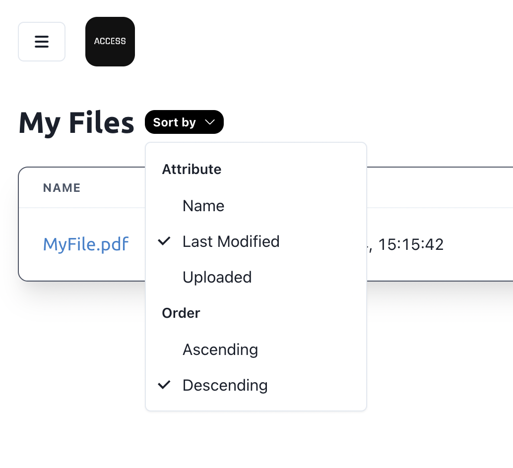
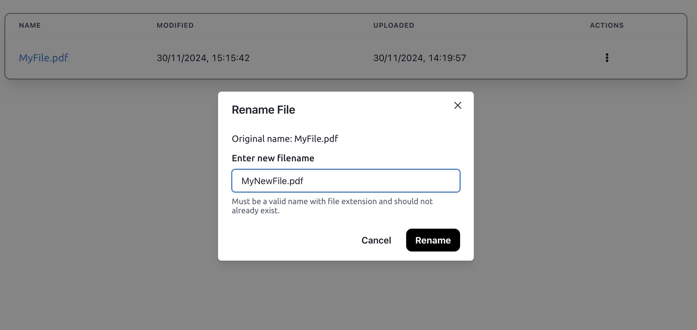
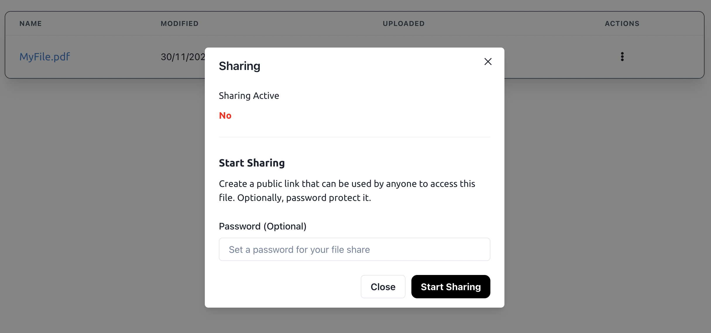

# Access

**Access is a simple, easy-to-use cloud file storage system with neat features like file sharing and sorting. 🙌🤩** It is the perfect tool for quick, efficient and hassle free online file storage. ✨

Access is a Python Flask web server that renders a Vite-built React frontend designed with Chakra UI. The system can also use Firebase Realtime Database to act as a robust cloud database system. Incorporating a variety of complex logic, services and integrations, Access delivers a clean and smooth user experience for users. 🚀🤯

Hopefully, the system is live at: https://access.prakhar.app ! 🎉

## Show Don't Tell

**Dashboard**

Access' dashboard is a clean, minimalistic and easy-to-use interface that allows users to upload, download, share and manage their files. The dashboard is designed to be user-friendly and intuitive, making it easy for users to navigate and use the system. 📁📂

File actions are neatly obscured behind a menu button next to the filename, while other key actions like logout are neatly presented at the top.

The entire user experience was also designed to be responsive, adapting well to smaller screen formats. 📱

---

**Sorting**

Keeping track of files can get messy; so Access allows users to quickly sort their files by various attributes in ascending/descending order. The system also remembers the user's preference, so sorting is always consistent. 📝🔍

---

**Menu Actions**

Expected file actions like seeing last modified and uploaded date information, renaming and deleting files are neatly tucked behind a menu button. All the complex functionality is obscured behind neat modals that popover the screen to bring their attention to the task at hand. 📋🗑️

---

**Sharing**

---
Sharing Public View

---
My Account (Audit Logs)

## Background

## Access 2.0