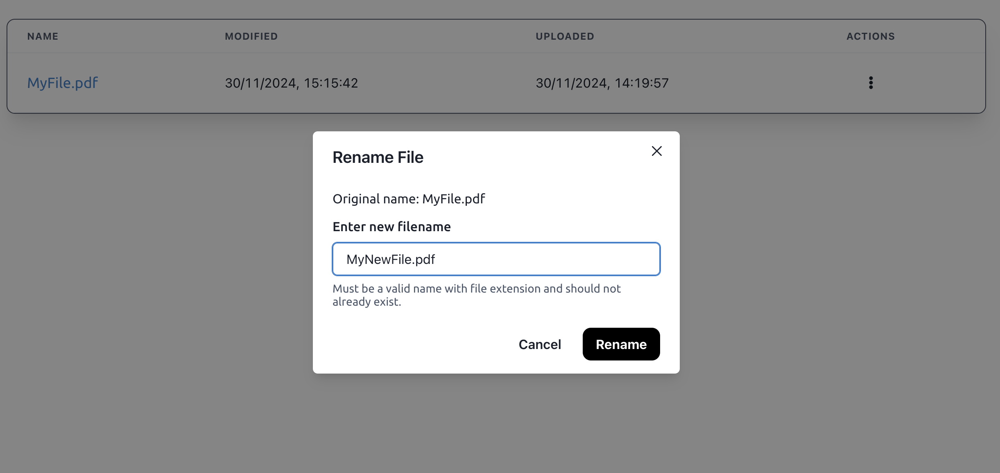
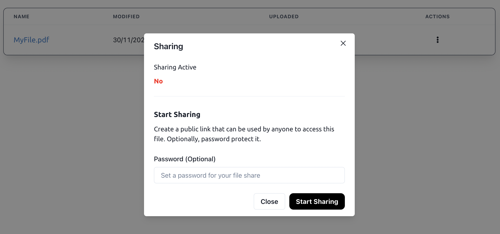

# Access

**Access is a simple, easy-to-use cloud file storage system with neat features like file sharing and sorting. 🙌🤩** It is the perfect tool for quick, efficient and hassle free online file storage. ✨

Access is a Python Flask web server that renders a Vite-built React frontend designed with Chakra UI. The system can also use Firebase Realtime Database to act as a robust cloud database system. Incorporating a variety of complex logic, services and integrations, Access delivers a clean and smooth user experience for users. 🚀🤯

Hopefully, the system is live at: [https://access.prakhar.app](https://access.prakhar.app) ! 🎉

[Check out the GitHub here! ✨](https://github.com/Prakhar896/Access)

## Show Don't Tell

**Dashboard**

Access' dashboard is a clean, minimalistic and easy-to-use interface that allows users to upload, download, share and manage their files. The dashboard is designed to be user-friendly and intuitive, making it easy for users to navigate and use the system. 📁📂

File actions are neatly obscured behind a menu button next to the filename, while other key actions like logout are neatly presented at the top.

The entire user experience was also designed to be responsive, adapting well to smaller screen formats. 📱

---

**Sorting**

Keeping track of files can get messy; so Access allows users to quickly sort their files by various attributes in ascending/descending order. The system also remembers the user's preference, so sorting is always consistent. 📝🔍

---

**Menu Actions**

Expected file actions like seeing last modified and uploaded date information, renaming and deleting files are neatly tucked behind a menu button. All the complex functionality is obscured behind neat modals that popover the screen to bring their attention to the task at hand. 📋🗑️

---

**Sharing**

Users often want to share important files with others. Access allows this through public links that can be tightly controlled by the user. Users can even password protect links, so that only those with the password can access the file. 🔒🔗

After starting sharing for a file, users can quickly copy the public link and start distributing. Access will also collect download metrics to help users understand how their files are being accessed. 📊📈

Sharing links can be deactivated and deleted ("Stop Sharing") anytime. 🛑

Public accessors can see this when trying to use a public file share link. Password protected files will require accessors to enter the password before downloading the file. 🔑

If all is right, hitting "Access" will start the download. 📥

---

**My Account**

Managing user information is super easy and intuitive in Access. In the My Account dashboard, which can be accessed through the sidebar on the left, users can update their username, email, and password. They can also see their last login and account creation date information. 📝🔒

All actions, like file uploads, email verification, renames, overwrites and more, are all attached to accounts as audit logs. These logs can be seen in the Audit Logs section for the user to trace changes. 📜

## Background

In early 2022, I was facing issues with cloud storage solutions like OneDrive and Google Drive. Around the same time, I was learning about Python and Flask, and I decided that, I could just build my own cloud storage system instead! Excited to apply the skills I was learning, I dived right in.

Of course, being still a novice to Python, Flask and web server programming, the code I wrote was not very good and had many issued throughout. I released updates that slowly fixed some of these pitfalls, but the UX was sitll very slow and unappealing. 2 years and the equipping of many new skills later, I decided to completely destroy and revamp Access from the ground up in a `2.0` update.

## Access 2.0

Access 2.0 is a complete revamp of the original Access System. A quick comparison:

| Old Architecture | New Architecture |
|------------------|------------------|
| Entire JSON database stored in-memory in one variable. No scalability, no failover. | Use Firebase Realtime Database as cloud database which is good way to backup data. |
| Difficult to update database. Saving just one attribute update would mean dumping the whole database entirely to data file. | Custom database management system which incorporates failover-to-local-database. De-sync state handling. Referential data management for efficiency. Abstract base data model defining expectations for real data models for structured data definition. |
| No concurrency. | Incorporate concurrency for tasks that require more time like dispatching emails or saving files so that main worker is not held up. |
| Slow and unappealing UI. | Use React to design frontend and incorporate framer-motion library to create animations. |

The new Access is designed to be more robust, efficient and user-friendly. It incorporates a variety of new features and improvements that make it a much better system than the original. 🚀🤯

Access 1.x users, I highly recommend upgrading to the new Access system, but unfortunately, due to the entirely new architecture, I could not implement automatic backwards compatibility. Please taking note that existing Access 1.x data files and databases are not compatible with Access 2.0 before updating!

It is recommended to use the [new updater script](https://github.com/Prakhar896/Access/blob/6350875ff26442a5c268be4479a3347c8b31a499/updater.py) to update to Access 2.x, as it supports the new architecture.

---

Thanks for checking out Access, have a great day! 🎉🚀

© 2022-2024 Prakhar Trivedi. All rights reserved.

 
