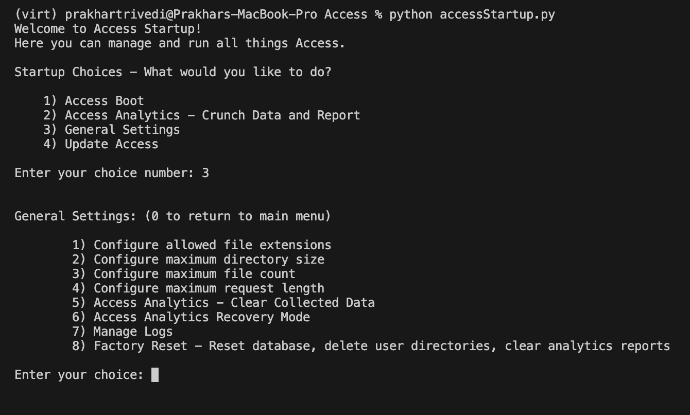

# Setup Guide

Access' inner workings are rather unique and fluid. Multiple sub-systems and components work in efficient harmony to deliver a great user experience. Access is highly clone-friendly, and can be easily set up by yourself.

## Pre-requisites

- [Python 3.11](https://www.python.org/downloads)
- [Git](https://git-scm.com/downloads)

If you are looking to enable emailing services, you will need a Google Account to which Access can connect to for SMTP-based email dispatch. For authorisation, [App Passwords](https://support.google.com/accounts/answer/185833?hl=en#zippy=%2Cwhy-you-may-need-an-app-password%2Capp-passwords-revoked-after-password-change) are used. Steps:
1. Create a Google Account if you don't have one.
2. Enable 2FA on the Google Account, if not already enabled.
3. Go to the [MyAccount dashboard](https://myaccount.google.com)
4. Go to Security > [App Passwords](https://myaccount.google.com/apppasswords)
5. Give your new app password a name and generate it. Store the password in a safe place. The spaces don't matter, and you should just remove them to form one string.

If you are looking to enable the Firebase Realtime Database syncing, follow these steps to get your Firebase project ready:
1. Visit the [Firebase Console](https://console.firebase.google.com)
2. Create a new project
3. Go to Project Overview > Project Settings > Service accounts and click "Generate new private key". The key should be downloaded as a JSON file to your computer.
4. Rename the JSON file to `serviceAccountKey.json`

## Installing Access

### Downloading source code

There's a few ways to do this. You can either visit the [source code releases](https://github.com/Prakhar896/Access/releases) and download the zip package of your intended version, or you can clone the repository using Git.

If cloning, here's the Git command:
```zsh
git clone https://github.com/Prakhar896/Access
```

Either way, be aware of where you're cloning/downloading the source code. This will be important in the following steps.

### Setting up the environment

1. Open a terminal and navigate to the root directory of the source code.
2. If you wish, [create a virtual environment](https://docs.python.org/3/library/venv.html) for the project and activate it. This is optional but recommended.
3. Install the required dependencies using pip:
```zsh
pip install -r requirements.txt
```
4. If you wish to enable Firebase Realtime Database syncing, place the `serviceAccountKey.json` file in the root directory of the source code.
5. Create a `.env` file in the root directory. Various components of the system can be configured through this file. Here's a guide:
```env
RuntimePort= # required, port on which the system will run.
SYSTEM_URL= # required, URL of the system used in emails. for local development, use http://localhost:<RuntimePort>
APP_SECRET_KEY= # required, used to encrypt user sessions. any string will do.
APIKey= # required, API key for request authorisation. any string will do.
LOGGING_ENABLED= # required, set to True to enable logging.
AccessAnalyticsEnabled= # required, set to True to enable Access Analytics.
EMAILING_ENABLED= # required, set to True to enable emailing services.
FireConnEnabled= # required, set to True to enable connections with Firebase
FireRTDBEnabled= # required, set to True to enable database syncing with a Firebase Realtime Database. requires FireConnEnabled to be True, if enabled.
RTDB_URL= # optional, required if FireRTDBEnabled is True. this is the URL of the Firebase Realtime Database.
SENDER_EMAIL= # optional, required if EMAILING_ENABLED is True. this is the email of the Google Account through which SMTP emails will be sent.
SENDER_EMAIL_APP_PASSWORD= # optional, required if EMAILING_ENABLED is True. this is the app password of the Google Account through which SMTP emails will be sent.
CLEANER_DISABLED= # optional, set to True to disable the cleaner agent. the cleaner agent helps to clean up unverified accounts every 3 hours.
DEBUG_MODE= # optional, set to True to enable debug mode. this will enable debug messages and stack traces in the console.
DECORATOR_DEBUG_MODE= # optional, set to True to see debug messages from requests processed by decorators
```

### Running

Access Startup is a service that acts as a launchpad for various services, including boot. It is the recommended way to run the system.

1. Open a terminal and navigate to the root directory of the source code.
2. Run `python accessStartup.py` to start the interactive startup menu.
3. Select the `Access Boot` option to start the web server.

Alternatively, of course, you can run the system directly with:
```zsh
python main.py
```

Note: If your copy of Access hasn't been activated, the activation procedure might be triggered on your first boot. [More information here.](#activator-x-access)

## Activator x Access


[Activator](https://github.com/Prakhar896/ActivatorDocs) is a product activation system made by me that activates many of my projects source code. Access is one of these.

Activation is completely free and effortless, and the procedure is in place to serve a benefit to you. After activation, you can visit the Activator portal and easily see all copies across any of my products that you have activated. You can conveniently visit the portal by clicking on the link in the auto-generated `licensekey.txt` file after activation for any copy.

**What happens during activation?**
1. If an existing license key is not found, Access connects to the global Activator server and starts the activation procedure with it's unique product code and version number.
2. A custom algorithm generates identifiers for both the copy and your computer based on hardware identifiers in a privacy-conscious manner. Rest assured, no personal data is collected. These identifiers are submitted to the server.
3. Activator accounts are based on computers. If it's your first time activating a product with Activator, a new account is created with your computer's identifier. Other copies you activate will be linked to this account as the computer identifier would be the same.
4. The server generates a unique license key for your copy of Access and sends it back. This key is stored in a `licensekey.txt` file in the root directory of the source code.

**Benefits**
- Deactivation: Through the Activator portal, you can remotely deactivate/invalidate any license key and thus interrupt the functioning of the copy it's linked to. This is useful if you lose access to a copy or if it's compromised.
- Centralised management: All copies of my projects that you activate are linked to your Activator account. You can easily see all copies across any of my products that you have activated.
- Security: The activation system is designed to be secure and privacy-conscious. No personal data is collected during activation. If you password protect your Activator account, Activator will demand your password for future copy activations linked to your computer identifier.

## Components of Access

Access is a complex system with multiple components working together. Here's a brief overview of the components:
- **Access Startup**: A service that acts as a launchpad for various services, including boot, analytics data crunching and factory reset.
- **Emailer**: A service that dispatches emails using SMTP. This is used for email verification, password reset and other email dispatches.
- **AccessAnalytics**: A service that collects anonymised data about how users are using Access in the background. You can crunch this data to get insights into user behaviour from the Access Startup menu. Crunched reports are saved in `./analyticsReports`.
- **AFManager (Access Folder Manager)**: Sets up and works with a `./Directories` folder where all of the user directories and files are stored. Used extensively to manage user files.
- **DatabaseInterface**: A mid-level interface that abstracts the database layer. Works with `FireRTDB` and `FireConn` sub-services for Firebase syncing, if enabled.
- **Services**: Various services like `Universal`, `Encryption` and `Logger` that provide utility functions to the system. Additionally, the `AsyncProcessor` wrapper on top of the `APScheduler` library adds async capabilities to the system.
- **Flask APIs**: Various API endpoints including `userProfile.py`, `identity.py`, `panel.py`, `sharing.py` and `directory.py` deliver business logic to the frontend.
- **Vite-compiled React Frontend**: The React frontend source code is at `./frontend`. The compiled HTML, CSS and JS is at `./templates` and `./assets`. The frontend is served by the Flask server through `frontend.py`.

## Changing settings



In the Access Startup menu, you can open a sub-menu called General Settings where you can change a few parameters. A change in any of these parameters would require a reboot of the server if it's already running.

Some of the most important settings:
- **User storage behaviour:** Any of the below have default limits but they can be changed as per your requirements.
    - Allowed file extensions: Change the types of files that can be uploaded.
    - Max directory size: Change the maximum size of a user directory. Default is `100MB`.
    - Max file count: Maximum number of files that can be stored in a user directory. Default is `20`.
    - Max request length: Limit on the size of any given request going into the system. Default is `100MB`.
- **Access Analytics - Clear Collected Data**: Clears any existing data metrics.
- **Access Analytics Recovery Mode**: If there are issues in Access Analytics' data file, this is a good tool to help you recover the state of the data file.
- **Manage Logs**: Read, filter, and destroy logs from the system.
- **Factory Reset**: Resets all system databases. Deletes user directories, system database, user storage configuration settings, analytics data and reports. This is a destructive operation and should be used with caution.

---

Thanks for choosing Access! For any issues, please open an issue and I will get back to you as soon as possible.

Have a great day! 🚀

© 2022-2024 Prakhar Trivedi. All rights reserved.